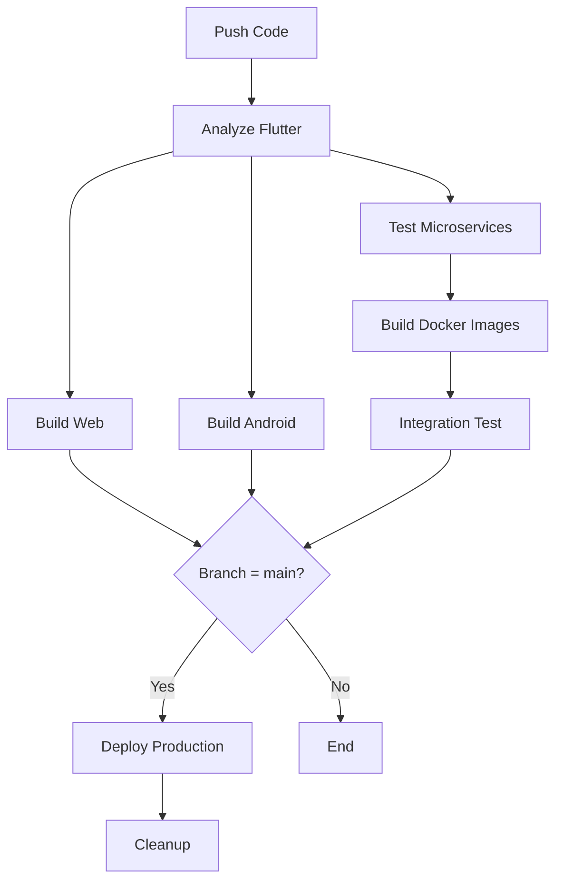

# 🚀 CI/CD Pipeline Configuration Guide

## 📋 Overview

Pipeline này tự động hóa toàn bộ quy trình build, test và deploy cho dự án **Finance AI**.

### Workflow Stages:
1. **Analyze Flutter** - Kiểm tra code quality
2. **Build Web** - Build Flutter Web (CanvasKit)
3. **Build Android** - Build APK (split-per-abi)
4. **Test Microservices** - Analyze Dart microservices
5. **Build Docker** - Build Docker images
6. **Integration Test** - Test toàn bộ hệ thống với Docker Compose
7. **Deploy Production** - Deploy lên server (chỉ khi push vào `main`)
8. **Cleanup** - Dọn dẹp artifacts cũ

---

## 🔐 Required GitHub Secrets

Để pipeline hoạt động, bạn cần cấu hình các **Secrets** sau trong GitHub Repository:

### Vào: `Settings` → `Secrets and variables` → `Actions` → `New repository secret`

| Secret Name | Description | Example |
|------------|-------------|---------|
| `SUPABASE_URL` | URL của Supabase project | `https://xxx.supabase.co` |
| `SUPABASE_ANON_KEY` | Supabase Anonymous Key | `eyJhbGciOiJIUzI1NiIsInR5cCI6IkpXVCJ9...` |

> **Lưu ý:** Pipeline này chỉ build và test. Nếu muốn deploy, bạn cần tự động hóa riêng hoặc deploy thủ công.

---

## 🛠️ Setup Instructions

### 1. Cấu hình GitHub Secrets

Vào **Settings** → **Secrets and variables** → **Actions**, thêm 2 secrets:

```
SUPABASE_URL=https://baypebptjfrnclsgtddd.supabase.co
SUPABASE_ANON_KEY=eyJhbGciOiJIUzI1NiIsInR5cCI6IkpXVCJ9...
```

### 2. Test Pipeline Locally (Optional)

Bạn có thể test pipeline trên máy local bằng [act](https://github.com/nektos/act):

```bash
# Install act
choco install act-cli  # Windows
brew install act       # macOS

# Run workflow locally
act -j analyze-flutter
act -j build-web
```

---

## 🎯 Trigger Pipeline

### Tự động:
- **Push** vào branch `main` hoặc `develop` → Chạy toàn bộ pipeline
- **Pull Request** → Chạy build + test (không deploy)

### Thủ công:
Vào tab **Actions** → Chọn workflow **Finance AI - CI/CD Pipeline** → Click **Run workflow**

---

## 📊 Pipeline Flow Diagram



---

## 🐛 Troubleshooting

### Lỗi: "Flutter analyze failed"
- Chạy `flutter analyze` trên local để xem lỗi cụ thể
- Sửa các warning/error trước khi push

### Lỗi: "Docker build failed"
- Kiểm tra Dockerfile syntax
- Đảm bảo `packages/core_domain` có trong context

### Lỗi: "SSH connection refused"
- Kiểm tra SSH_PRIVATE_KEY đã paste đúng chưa (bao gồm header/footer)
- Kiểm tra public key đã add vào server chưa: `cat ~/.ssh/authorized_keys`

### Lỗi: "Integration test failed"
- Kiểm tra SUPABASE_URL và SUPABASE_ANON_KEY trong Secrets
- Xem logs: `docker-compose logs` trong workflow

---

## 📝 Notes

- **Artifacts** (APK, Web build) được lưu 7 ngày
- **Workflow runs** cũ hơn 30 ngày sẽ tự động xóa
- Deploy chỉ chạy khi push vào `main` branch
- Có thể tắt auto-deploy bằng cách xóa job `deploy-production`

---

## 🔗 Useful Links

- [GitHub Actions Documentation](https://docs.github.com/en/actions)
- [Flutter CI/CD Best Practices](https://docs.flutter.dev/deployment/cd)
- [Docker Compose in CI](https://docs.docker.com/compose/ci/)
