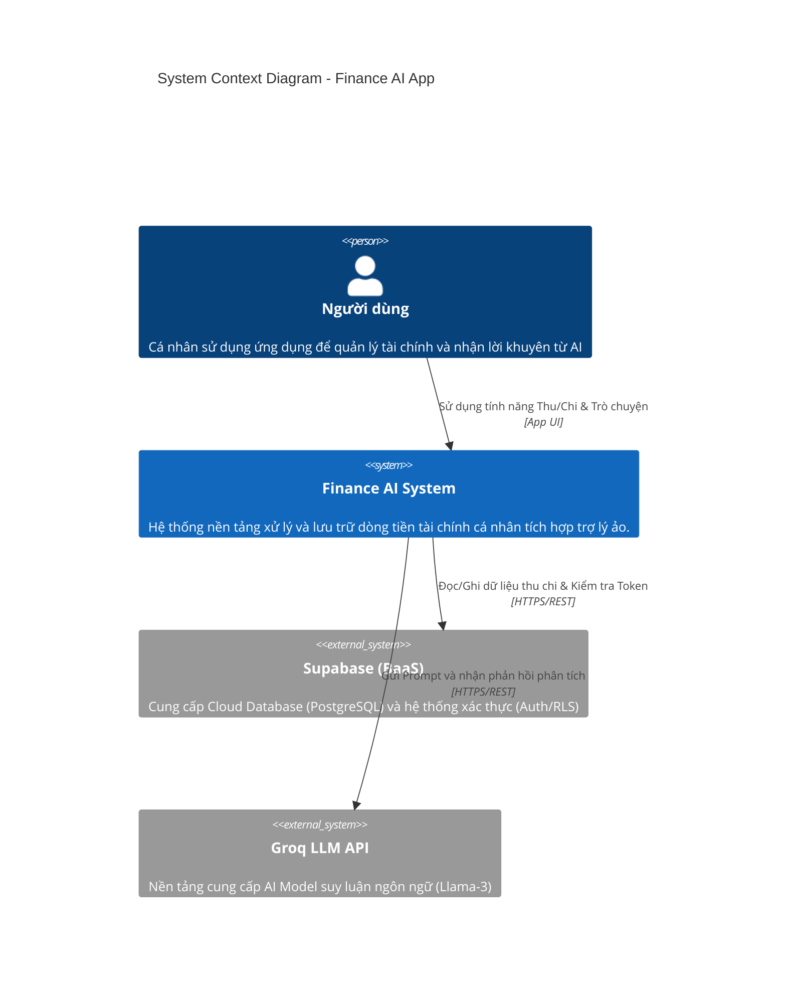
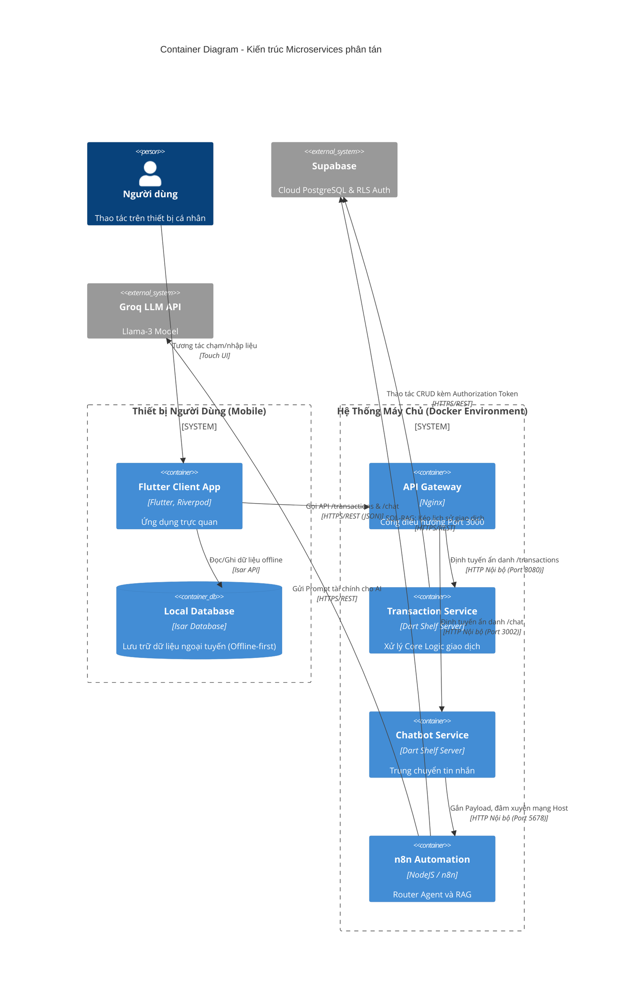
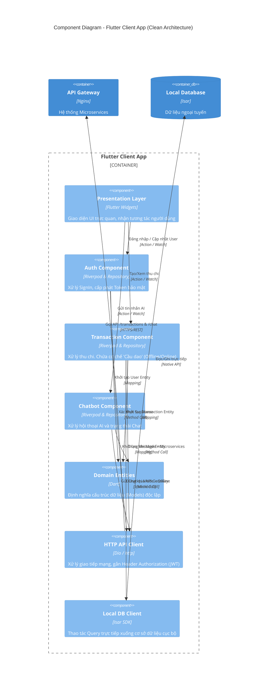

# Sơ đồ Kiến trúc C4: Finance AI App

Dưới đây là các gợi ý chi tiết và mã nguồn Mermaid để bạn có thể sao chép trực tiếp vào báo cáo của mình. Kiến trúc C4 rất phù hợp để giải thích hệ thống Microservices của bạn theo hướng từ tổng quan đến chi tiết.

---

## 1. System Context Diagram (Level 1)
**Mục đích:** Thể hiện bức tranh toàn cảnh nhất. Nhìn vào đây, người chấm sẽ biết có những ai sử dụng hệ thống, và hệ thống của bạn (Finance AI App) đang tương tác với những hệ thống bên ngoài nào.

*   **Người dùng (Person):** Cá nhân có nhu cầu quản lý thu chi và muốn được AI tư vấn tài chính.
*   **Hệ thống trung tâm (Software System):** Finance AI App của bạn.
*   **Hệ thống bên ngoài (External Systems):** 
    *   `Supabase`: Hệ thống CSDL đám mây (Database as a Service) và cấp phát bảo mật.
    *   `Groq LLM API`: Dịch vụ cung cấp não bộ AI cho n8n gọi tới.

### Mã Mermaid (Level 1):

---

## 2. Container Diagram (Level 2)
**Mục đích:** "Phóng to" hệ thống `Finance AI System` ở Level 1 ra để xem bên trong có các "thùng chứa" (Container) nào. Đây chính là nơi bạn "khoe" được kiến trúc Microservices và API Gateway.

*   **Flutter Client App:** Cung cấp UI đa nền tảng. Chứa Clean Architecture (Riverpod, Repositories).
*   **API Gateway (Nginx):** Cổng vào duy nhất (Port 3000), phá vỡ tường lửa CORS, đóng vai trò Reverse Proxy.
*   **Transaction Service (Dart Shelf):** Microservice chạy port 8080 phụ trách Business Logic thu/chi và cấp ủy quyền.
*   **Chatbot Service (Dart Shelf):** Microservice chạy port 3002, đóng vai trò chuyển tiếp tín hiệu xuyên biên giới mạng lưới.
*   **n8n Workflow Automation:** Xử lý luồng Node-based, đóng vai trò là Agent Router và SQL-based RAG.

### Mã Mermaid (Level 2):

---

## 3. Component Diagram (Level 3)
**Mục đích:** "Phóng to" vào một Container cụ thể để xem các thành phần bên trong nó hoạt động ra sao. Để thể hiện rõ năng lực thiết kế phần mềm, tôi chọn "phóng to" **Flutter Client App** vì nó minh họa xuất sắc mô hình **Clean Architecture** và **Cơ chế Cầu dao**.

*   **Presentation Layer:** Giao diện người dùng.
*   **Các Module Nghiệp Vụ (Auth, Transaction, Chatbot):** Gộp chung Controller (Riverpod) và Repository để giải quyết trọn vẹn từng chức năng độc lập. Nổi bật nhất là `Transaction Component` có chứa cơ chế "Cầu dao" tự động định tuyến.
*   **Domain Entities:** Ngôn ngữ chung, độc lập với nền tảng.
*   **API Client / Isar Client:** Tương tác trực tiếp với bên ngoài.

### Mã Mermaid (Level 3):

---
**💡 Gợi ý:** Bạn có thể copy các khối mã `mermaid` trên và dán vào các công cụ Render miễn phí (như [Mermaid Live Editor](https://mermaid.live/) hoặc plugin Markdown trên VSCode) để xuất thành file ảnh độ phân giải cao dán vào báo cáo Word của bạn. Sơ đồ Level 3 này là vũ khí tuyệt vời để ghi điểm tối đa về mặt "Phân tích và Thiết kế Phần mềm"!
