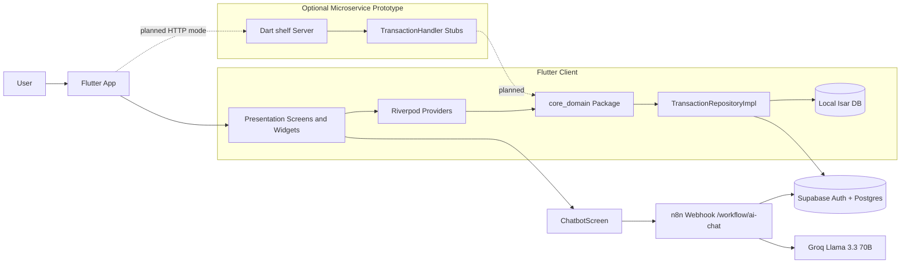
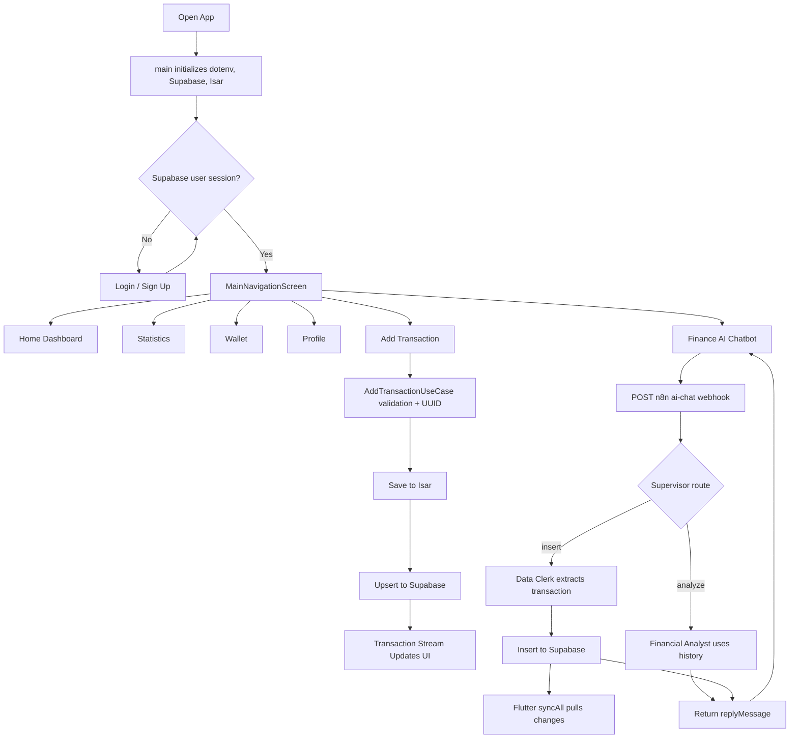
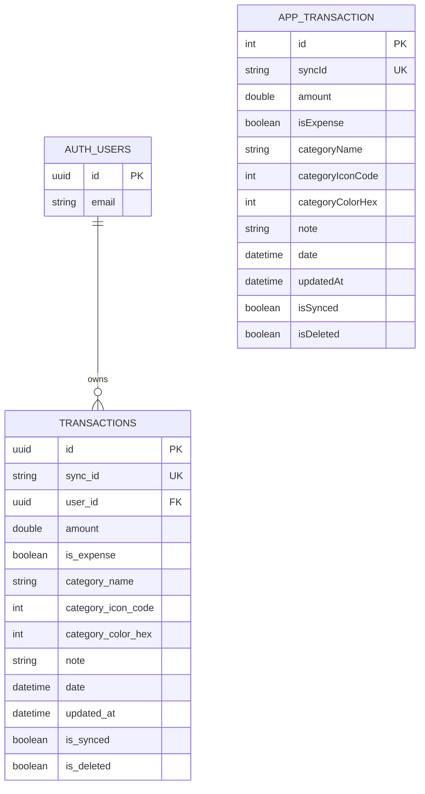

# App Context

Generated from repository inspection on 2026-04-30. This document is intended to help another AI or reviewer understand the app and write an academic/project report. Claims are tied to file evidence where possible. Items that cannot be verified from the repository are marked as uncertain.

## 1. Project Overview

### App Name

The project has inconsistent naming across files:

- `README.md` calls it **AI Finance Assistant (Flutter + n8n + Supabase)**.
- `app/lib/main.dart` sets the Flutter `MaterialApp` title to **Finance Manager**.
- `app/lib/presentation/screens/login_screen.dart` displays **Finance AI** on the login screen.
- Platform metadata still uses the default Flutter name **flutter_application_1** in `app/android/app/src/main/AndroidManifest.xml`, `app/web/manifest.json`, and `app/web/index.html`.

For report writing, **Finance AI - Personal Finance Assistant** is the clearest project name because it matches the login/chatbot UI and the README purpose.

### Main Purpose

The app is a personal finance management application. It lets users record income and expense transactions manually, view balances and statistics, synchronize data with Supabase, and interact with an AI chatbot that can record or analyze financial activity through an n8n workflow.

Evidence:

- Manual transaction entry is implemented in `app/lib/presentation/screens/add_transaction_screen.dart`.
- Balance and recent transaction display is implemented in `app/lib/presentation/screens/home_screen.dart` and `app/lib/presentation/widgets/balance_card.dart`.
- Statistics are implemented in `app/lib/presentation/screens/statistics_screen.dart`.
- AI chat is implemented in `app/lib/presentation/screens/chatbot_screen.dart`.
- Supabase/Isar synchronization is implemented in `app/lib/data/repositories/transaction_repository_impl.dart`.
- n8n workflow files are `My workflow11.json` and `My workflow11_MultiAgent.json`.

### Target Users

The likely target users are individual users who want to track income, expenses, spending categories, and personal finance patterns. The code supports single-user authenticated sessions via Supabase Auth rather than organization/team roles.

Evidence:

- Supabase email/password login and sign-up are in `app/lib/presentation/screens/login_screen.dart`.
- The current authenticated user's email is shown in `app/lib/presentation/screens/profile_screen.dart`.
- Transactions are written with the current `user_id` in `app/lib/data/repositories/transaction_repository_impl.dart` and by the n8n workflow in `My workflow11_MultiAgent.json`.

### Main Problem It Solves

The app addresses the difficulty of consistently recording and reviewing personal financial transactions. It supports quick manual entry, offline-first local storage, cloud synchronization, and AI-assisted natural language entry/analysis.

Evidence:

- Offline-first local storage uses Isar in `app/lib/data/models/app_transaction.dart` and `app/lib/data/repositories/transaction_repository_impl.dart`.
- Cloud sync uses Supabase `transactions` upsert/select calls in `app/lib/data/repositories/transaction_repository_impl.dart`.
- The chatbot sends user messages and recent transaction history to n8n in `app/lib/presentation/screens/chatbot_screen.dart`.

### Current Development Status

The repository looks like an in-progress MVP:

- The Flutter app has implemented screens for authentication, dashboard, manual transaction entry, statistics, wallet display, profile, and chatbot.
- The main app data path is implemented as a monolith-style Flutter client using Isar plus Supabase.
- The optional Dart microservice exists but its route handlers return stub/mock responses.
- The HTTP repository client for microservice mode is a skeleton and throws `UnimplementedError` for most methods.
- Tests exist but are partial: Isar CRUD tests, a smoke widget test, and a basic core-domain equality test.
- Platform metadata and app IDs still use default Flutter names.

Evidence:

- Main app data path: `app/lib/presentation/providers/app_providers.dart`.
- Implemented repository: `app/lib/data/repositories/transaction_repository_impl.dart`.
- Skeleton HTTP repository: `app/lib/data/repositories/transaction_repository_http.dart`.
- Stub microservice handler: `microservices/transaction_service/lib/handlers/transaction_handler.dart`.
- Tests: `app/test/isar_test.dart`, `app/test/widget_test.dart`, `packages/core_domain/test/core_domain_test.dart`.
- Default platform names: `app/android/app/build.gradle.kts`, `app/android/app/src/main/AndroidManifest.xml`, `app/web/manifest.json`.

## 2. Tech Stack

### Frontend Framework

- Flutter app using Dart.
- Dart SDK constraint is `^3.11.0` in `app/pubspec.yaml`.
- Flutter project metadata says stable channel in `app/.metadata`.
- `app/doctor_output.txt` records Flutter `3.41.2`, but this is an environment snapshot, not a dependency lock.

### Backend Frameworks / Backend Services

- Supabase is the primary backend service used by the Flutter app.
- n8n is used as an AI workflow backend for chatbot requests.
- A Dart backend microservice exists under `microservices/transaction_service` using `shelf` and `shelf_router`.

Evidence:

- Supabase Flutter dependency: `app/pubspec.yaml`.
- Supabase initialization: `app/lib/main.dart`.
- n8n webhook call: `app/lib/presentation/screens/chatbot_screen.dart`.
- n8n workflows: `My workflow11.json`, `My workflow11_MultiAgent.json`.
- Shelf microservice dependencies: `microservices/transaction_service/pubspec.yaml`.
- Shelf server entry point: `microservices/transaction_service/bin/server.dart`.

### Database

- Local database: Isar (`isar`, `isar_flutter_libs`, `isar_generator`) in `app/pubspec.yaml`.
- Cloud database: Supabase PostgreSQL table named `transactions`, used by the Flutter repository and n8n workflow.

Evidence:

- Isar model: `app/lib/data/models/app_transaction.dart`.
- Generated Isar schema: `app/lib/data/models/app_transaction.g.dart`.
- Supabase table usage: `app/lib/data/repositories/transaction_repository_impl.dart`, `My workflow11_MultiAgent.json`, `README.md`.

### Authentication Method

- Supabase Auth with email/password.
- Sign-up uses `auth.signUp`.
- Login uses `auth.signInWithPassword`.
- Auth state is watched through `auth.onAuthStateChange`.

Evidence:

- `app/lib/presentation/screens/login_screen.dart`
- `app/lib/presentation/screens/auth_gate.dart`

### State Management

- Riverpod (`flutter_riverpod`, `riverpod_annotation`, `riverpod_generator`) is used.
- Providers are defined for Isar, Supabase, repositories, use cases, transaction streams, totals, and chat messages.

Evidence:

- Dependencies: `app/pubspec.yaml`.
- App-wide providers: `app/lib/presentation/providers/app_providers.dart`.
- Chat message notifier: `app/lib/presentation/screens/chatbot_screen.dart`.

### Styling / UI Library

- Flutter Material widgets and a custom `AppTheme`.
- No third-party UI component library is visible.
- Charts are hand-drawn using `CustomPainter`, not a chart package.

Evidence:

- Theme: `app/lib/presentation/theme/app_theme.dart`.
- Custom line/pie painters: `app/lib/presentation/screens/statistics_screen.dart`.

### External Services / APIs

- Supabase Auth and Supabase database.
- n8n webhook at `http://localhost:5678/webhook/ai-chat` in the Flutter chatbot code.
- Groq Llama model `llama-3.3-70b-versatile` in n8n workflow JSON.
- Network avatar image from `https://i.pravatar.cc/150?img=11`.

Evidence:

- `app/lib/presentation/screens/chatbot_screen.dart`
- `My workflow11_MultiAgent.json`
- `app/lib/presentation/screens/home_screen.dart`
- `app/lib/presentation/screens/profile_screen.dart`

### Deployment Tools

- Standard Flutter platform folders exist for Android, iOS, web, Windows, macOS, and Linux.
- Android uses Gradle/Kotlin configuration.
- iOS/macOS use Xcode project files.
- Windows/Linux use CMake runner files.
- No Dockerfile, docker-compose file, CI pipeline, or cloud deployment config was found.

Evidence:

- `app/android/`
- `app/ios/`
- `app/web/`
- `app/windows/`
- `app/macos/`
- `app/linux/`
- Missing deployment artifacts inferred from `rg --files` repository listing.

### Testing Tools

- `flutter_test` is used in the Flutter app and core package.
- Isar test coverage exists for basic CRUD/query/aggregation.
- Linting uses `flutter_lints` in the Flutter app and core package; the microservice uses `lints`.

Evidence:

- `app/test/widget_test.dart`
- `app/test/isar_test.dart`
- `packages/core_domain/test/core_domain_test.dart`
- `app/analysis_options.yaml`
- `packages/core_domain/analysis_options.yaml`
- `microservices/transaction_service/pubspec.yaml`

## 3. Folder Structure Explanation

### Root

- `README.md`
  - Responsibility: Main project overview, setup guide, architecture summary, Supabase/n8n setup notes.
  - Why it matters: It explains intended system architecture beyond what is fully implemented in code.

- `build_n8n.py`
  - Responsibility: Generates `My workflow11_MultiAgent.json` from `My workflow11.json` by adding supervisor/data clerk/analyst workflow nodes.
  - Why it matters: It documents how the multi-agent n8n workflow was constructed.

- `My workflow11.json`
  - Responsibility: Single-agent n8n workflow for `POST /webhook/ai-chat`, AI extraction, Supabase insert, and webhook response.
  - Why it matters: It is part of the chatbot backend.

- `My workflow11_MultiAgent.json`
  - Responsibility: Multi-agent n8n workflow with a supervisor router, data clerk insert flow, and financial analyst flow.
  - Why it matters: It is the more complete AI workflow referenced by the README.

### `app/`

- `app/pubspec.yaml`
  - Responsibility: Flutter app dependencies, SDK constraints, assets, version.
  - Why it matters: Defines the app stack: Flutter, Isar, Supabase, Riverpod, dotenv, window manager, and local `core_domain`.

- `app/lib/main.dart`
  - Responsibility: App entry point. Initializes Flutter bindings, Windows window size, `.env`, Supabase, Isar, and Riverpod provider scope.
  - Why it matters: It wires together the app's runtime dependencies.

- `app/lib/data/models/app_transaction.dart`
  - Responsibility: Isar collection model for persisted transactions and mapper to/from `TransactionEntity`.
  - Why it matters: It defines the local database shape.

- `app/lib/data/models/app_transaction.g.dart`
  - Responsibility: Generated Isar schema/query code.
  - Why it matters: It proves the local collection fields and indexes used by Isar.

- `app/lib/data/repositories/transaction_repository_impl.dart`
  - Responsibility: Current production repository implementation for `ITransactionRepository`, using Isar for local storage and Supabase for sync.
  - Why it matters: It contains the main persistence, sync, push, pull, and soft-delete logic.

- `app/lib/data/repositories/transaction_repository_http.dart`
  - Responsibility: Planned HTTP implementation of `ITransactionRepository` for microservice mode.
  - Why it matters: It shows intended microservice architecture, but it is not implemented yet.

- `app/lib/data/repositories/transaction_repository.dart`
  - Responsibility: Older/direct repository class using `AppTransaction` directly.
  - Why it matters: It contains similar Isar/Supabase sync logic but is not the active provider implementation in `app_providers.dart`.

- `app/lib/presentation/providers/app_providers.dart`
  - Responsibility: Riverpod providers for Isar, Supabase, repository interface, use cases, transaction stream, and computed totals.
  - Why it matters: It is the dependency injection and state-management hub.

- `app/lib/presentation/screens/auth_gate.dart`
  - Responsibility: Checks Supabase session and switches between login and main navigation.
  - Why it matters: It controls authenticated vs unauthenticated app access.

- `app/lib/presentation/screens/login_screen.dart`
  - Responsibility: Email/password sign-up and login UI.
  - Why it matters: It is the only implemented auth entry point.

- `app/lib/presentation/screens/main_navigation_screen.dart`
  - Responsibility: Bottom navigation shell, initial sync, Supabase realtime listener, add-transaction FAB, chatbot FAB.
  - Why it matters: It coordinates the main screens and sync behavior after login.

- `app/lib/presentation/screens/home_screen.dart`
  - Responsibility: Dashboard with greeting, balance card, recent transactions, pull-to-refresh sync.
  - Why it matters: It is the main transaction overview screen.

- `app/lib/presentation/screens/add_transaction_screen.dart`
  - Responsibility: Manual transaction form for amount, type, category, date, and note.
  - Why it matters: It is the primary non-AI transaction creation flow.

- `app/lib/presentation/screens/statistics_screen.dart`
  - Responsibility: Transaction filtering, net/income/expense summaries, custom line chart, category pie chart, detail list.
  - Why it matters: It implements analytics/reporting inside the app.

- `app/lib/presentation/screens/wallet_screen.dart`
  - Responsibility: Displays derived wallet balances.
  - Why it matters: It presents wallet UI, but the wallet split is currently simulated.

- `app/lib/presentation/screens/profile_screen.dart`
  - Responsibility: Shows current user email, static profile items, logout.
  - Why it matters: It contains sign-out and local data clearing.

- `app/lib/presentation/screens/chatbot_screen.dart`
  - Responsibility: Chat UI, chat state, n8n webhook request, recent transaction history packaging, AI response handling.
  - Why it matters: It is the bridge from Flutter to the AI workflow.

- `app/lib/presentation/widgets/balance_card.dart`
  - Responsibility: Computes and displays income, expense, and total balance from transaction stream.
  - Why it matters: It implements visible finance summary calculations.

- `app/lib/presentation/widgets/transaction_item.dart`
  - Responsibility: Reusable transaction list row.
  - Why it matters: It standardizes transaction display across Home and Statistics.

- `app/lib/presentation/utils/category_utils.dart`
  - Responsibility: Maps category names to Flutter icons and colors.
  - Why it matters: It keeps category display consistent.

- `app/lib/presentation/utils/transaction_actions.dart`
  - Responsibility: Shared edit/delete bottom sheet and edit dialog.
  - Why it matters: It implements transaction update and soft-delete actions from multiple screens.

- `app/lib/presentation/theme/app_theme.dart`
  - Responsibility: Custom light/dark theme colors and Material theme settings.
  - Why it matters: It defines the app's visual system.

- `app/test/isar_test.dart`
  - Responsibility: Isar CRUD/query/aggregation tests.
  - Why it matters: It validates the local database model behavior.

- `app/test/widget_test.dart`
  - Responsibility: Minimal smoke test for `FinanceApp`.
  - Why it matters: It proves a placeholder test exists but does not validate major flows.

### `packages/core_domain/`

- `packages/core_domain/lib/core_domain.dart`
  - Responsibility: Barrel export for entities, repository interfaces, and use cases.
  - Why it matters: It is the shared domain API.

- `packages/core_domain/lib/entities/transaction_entity.dart`
  - Responsibility: Framework-independent transaction entity.
  - Why it matters: It is the common data model across Flutter repository implementations and planned microservices.

- `packages/core_domain/lib/repositories/i_transaction_repository.dart`
  - Responsibility: Repository contract for transaction reads, writes, deletes, and sync.
  - Why it matters: It separates domain/use-case logic from Isar, Supabase, and HTTP infrastructure.

- `packages/core_domain/lib/use_cases/add_transaction_use_case.dart`
  - Responsibility: Validates and creates new transaction entities with UUID/timestamp.
  - Why it matters: It contains important business rules for creation.

- `packages/core_domain/lib/use_cases/update_transaction_use_case.dart`
  - Responsibility: Validates and updates transaction entities, timestamping and marking unsynced.
  - Why it matters: It contains important business rules for updates.

- `packages/core_domain/lib/use_cases/delete_transaction_use_case.dart`
  - Responsibility: Validates sync ID and delegates soft delete.
  - Why it matters: It keeps deletion behavior consistent.

- `packages/core_domain/lib/use_cases/sync_transactions_use_case.dart`
  - Responsibility: Delegates full synchronization to the repository.
  - Why it matters: It exposes sync as a domain operation.

### `microservices/transaction_service/`

- `microservices/transaction_service/pubspec.yaml`
  - Responsibility: Dart microservice dependencies (`shelf`, `shelf_router`, local `core_domain`).
  - Why it matters: It defines the optional backend service stack.

- `microservices/transaction_service/bin/server.dart`
  - Responsibility: Starts HTTP server, registers routes, adds logging and CORS middleware.
  - Why it matters: It defines the available REST endpoints.

- `microservices/transaction_service/lib/handlers/transaction_handler.dart`
  - Responsibility: Handles transaction HTTP routes.
  - Why it matters: It shows intended REST behavior, but the implementation is currently stub/mock.

## 4. Feature List

### Authentication Module

- Purpose: Allow users to sign up, log in, stay logged in, and log out.
- User flow:
  1. App starts at `AuthGate`.
  2. If no Supabase session exists, user sees `LoginScreen`.
  3. User enters email/password and either signs up or logs in.
  4. Supabase auth state changes, and `AuthGate` shows `MainNavigationScreen`.
  5. User logs out from `ProfileScreen`; Supabase signs out and Isar local data is cleared.
- Main files:
  - `app/lib/main.dart`
  - `app/lib/presentation/screens/auth_gate.dart`
  - `app/lib/presentation/screens/login_screen.dart`
  - `app/lib/presentation/screens/profile_screen.dart`
  - `app/lib/presentation/providers/app_providers.dart`
- Important components/functions:
  - `Supabase.initialize(...)` in `main.dart`
  - `_checkSession()` in `auth_gate.dart`
  - `_handleAuth()` in `login_screen.dart`
  - `supabase.auth.signOut()` in `profile_screen.dart`
- Current limitations:
  - No local form validation for email format or password rules.
  - No password reset flow.
  - No role-based authorization.
  - Email confirmation handling is not visible in code.

### Manual Transaction Management Module

- Purpose: Let users add, edit, and delete income/expense transactions.
- User flow:
  1. User taps the center add FAB in `MainNavigationScreen`.
  2. `AddTransactionScreen` opens.
  3. User selects expense/income, category, date, amount, and note.
  4. The screen calls `AddTransactionUseCase.execute(...)`.
  5. The active repository saves locally to Isar and attempts Supabase sync.
  6. User can tap/long-press a transaction in Home or Statistics to edit/delete through `TransactionActions`.
- Main files:
  - `app/lib/presentation/screens/add_transaction_screen.dart`
  - `app/lib/presentation/utils/transaction_actions.dart`
  - `packages/core_domain/lib/use_cases/add_transaction_use_case.dart`
  - `packages/core_domain/lib/use_cases/update_transaction_use_case.dart`
  - `packages/core_domain/lib/use_cases/delete_transaction_use_case.dart`
  - `app/lib/data/repositories/transaction_repository_impl.dart`
- Important components/functions:
  - `AddTransactionUseCase.execute`
  - `UpdateTransactionUseCase.execute`
  - `DeleteTransactionUseCase.execute`
  - `TransactionRepositoryImpl.addTransaction`
  - `TransactionRepositoryImpl.updateTransaction`
  - `TransactionRepositoryImpl.deleteTransaction`
  - `TransactionActions.showOptions`
- Current limitations:
  - Categories are hardcoded and duplicated in add/edit flows.
  - Edit dialog does not change expense/income type or date.
  - Add screen silently returns if parsed amount is `<= 0` after the initial empty check.
  - Delete is soft-delete in the repository; the Isar unit test separately tests physical delete, not the repository soft-delete behavior.

### Dashboard / Home Module

- Purpose: Show total balance and recent transactions.
- User flow:
  1. After login, user lands on Home tab.
  2. `BalanceCard` listens to transaction stream and calculates income, expenses, and net total.
  3. `HomeScreen` shows recent transactions.
  4. Pull-to-refresh or sync icon calls sync use case.
- Main files:
  - `app/lib/presentation/screens/home_screen.dart`
  - `app/lib/presentation/widgets/balance_card.dart`
  - `app/lib/presentation/widgets/transaction_item.dart`
  - `app/lib/presentation/providers/app_providers.dart`
- Important components/functions:
  - `transactionsStreamProvider`
  - `BalanceCard.build`
  - `_buildTransactionList`
- Current limitations:
  - Greeting/name is hardcoded as `Alex Johnson`.
  - `See All` button has no implemented action.
  - Avatar is a static external placeholder URL.

### Statistics Module

- Purpose: Analyze transactions by time filter and type.
- User flow:
  1. User opens Stats tab.
  2. User chooses Day/Week/Month/Year.
  3. User chooses Net/Expense/Income.
  4. Screen calculates summary, line chart buckets, optional category pie chart, and detail list.
- Main files:
  - `app/lib/presentation/screens/statistics_screen.dart`
  - `app/lib/presentation/widgets/transaction_item.dart`
  - `app/lib/presentation/utils/category_utils.dart`
  - `app/lib/presentation/utils/transaction_actions.dart`
- Important components/functions:
  - `_getFilteredTransactions`
  - `_buildSummaryAndLineChart`
  - `_buildPieChartSection`
  - `_LineChartPainter`
  - `_PieChartPainter`
- Current limitations:
  - Charts are custom painters without axis scale labels for amounts.
  - Week buckets use weekday position, while filtering uses last 7 days; this can mix days from different weeks.
  - Month buckets always allocate 31 days even for shorter months.
  - Search button only shows a snackbar.

### Wallet Module

- Purpose: Display wallet-style balance cards.
- User flow:
  1. User opens Wallet tab.
  2. The screen computes total net balance from transactions.
  3. It displays 70% as "Main Wallet" and 30% as "Savings".
- Main files:
  - `app/lib/presentation/screens/wallet_screen.dart`
- Important components/functions:
  - `WalletScreen.build`
  - `_buildCreditCard`
- Current limitations:
  - Wallets are simulated; there is no wallet entity, wallet table, or wallet CRUD.
  - "Add New Wallet" has no action.
  - Card numbers are static placeholders.

### Profile Module

- Purpose: Show user email and profile/settings options.
- User flow:
  1. User opens Profile tab.
  2. User sees email from Supabase current user.
  3. User can tap Log Out to sign out and clear local Isar data.
- Main files:
  - `app/lib/presentation/screens/profile_screen.dart`
- Important components/functions:
  - `ref.watch(supabaseProvider).auth.currentUser`
  - logout `onTap`
- Current limitations:
  - Settings items except Log Out have no implemented action.
  - "Premium Member" label is static.
  - Local Isar clear on logout clears all local collections, not just the current user's transactions.

### AI Chatbot Module

- Purpose: Allow natural language finance interaction through n8n and Groq-powered agents.
- User flow:
  1. User opens chatbot via floating button.
  2. User enters a message.
  3. The app adds the user message to local chat state.
  4. The app gathers up to 100 recent transactions from `transactionsStreamProvider`.
  5. It POSTs JSON to `http://localhost:5678/webhook/ai-chat`.
  6. n8n returns `replyMessage` or similar response.
  7. App adds AI reply to chat and triggers transaction sync if `replyMessage` exists.
- Main files:
  - `app/lib/presentation/screens/chatbot_screen.dart`
  - `My workflow11_MultiAgent.json`
  - `My workflow11.json`
  - `build_n8n.py`
- Important components/functions:
  - `ChatMessagesNotifier`
  - `_handleSubmitted`
  - n8n `Webhook` node
  - n8n `Supervisor Router`, `Data Clerk`, `Financial Analyst`
  - n8n `Prepare Payload`
  - n8n `Insert to Supabase`
- Current limitations:
  - The webhook URL is hardcoded to localhost in `chatbot_screen.dart`; `README.md` describes `N8N_WEBHOOK_URL`, but the app code does not read it.
  - n8n insert flow uses the current timestamp for `date` in `Prepare Payload`; it does not appear to use a parsed transaction date.
  - Chat history is stored only in memory via Riverpod notifier.
  - No timeout, retry policy, or status-code-specific handling is visible.

### Offline-First Sync Module

- Purpose: Store transactions locally first and synchronize with Supabase when possible.
- User flow:
  1. Add/update/delete writes to Isar.
  2. Repository tries to push the transaction to Supabase.
  3. If push succeeds, local `isSynced` becomes true.
  4. `syncAll()` pushes unsynced records and pulls Supabase rows.
  5. Main navigation subscribes to Supabase realtime changes for the current user and triggers sync.
- Main files:
  - `app/lib/data/repositories/transaction_repository_impl.dart`
  - `app/lib/presentation/screens/main_navigation_screen.dart`
  - `app/lib/data/models/app_transaction.dart`
  - `packages/core_domain/lib/use_cases/sync_transactions_use_case.dart`
- Important components/functions:
  - `TransactionRepositoryImpl._pushToSupabase`
  - `TransactionRepositoryImpl.syncAll`
  - `Supabase.instance.client.from('transactions').stream(...)`
- Current limitations:
  - `syncAll()` pulls `from('transactions').select()` without an explicit `.eq('user_id', user.id)` filter in app code; the README says RLS should enforce user isolation, but no SQL policy file exists in the repository.
  - Conflict resolution is "cloud row wins if `updated_at` is newer"; there is no merge UI.
  - Push failures are only logged with `debugPrint`.

### Optional Microservice Module

- Purpose: Provide a REST backend alternative for transaction operations.
- User flow:
  1. Developer runs `dart run bin/server.dart` in `microservices/transaction_service`.
  2. Server listens on `localhost:8080` by default.
  3. Routes respond to health/transactions requests.
  4. Flutter could use `TransactionRepositoryHttp`, but that implementation is currently not complete.
- Main files:
  - `microservices/transaction_service/bin/server.dart`
  - `microservices/transaction_service/lib/handlers/transaction_handler.dart`
  - `app/lib/data/repositories/transaction_repository_http.dart`
  - `microservices/README.md`
- Important components/functions:
  - `TransactionHandler.health`
  - `TransactionHandler.getTransactions`
  - `TransactionHandler.createTransaction`
  - `TransactionHandler.updateTransaction`
  - `TransactionHandler.deleteTransaction`
- Current limitations:
  - Routes return stub/mock data.
  - No persistent data store is wired into the microservice.
  - No authentication/JWT enforcement is implemented.
  - Flutter HTTP repository methods mostly throw `UnimplementedError`.

## 5. Architecture Summary

### Client / Server Relationship

The active architecture is a Flutter client connected directly to Supabase and to an n8n webhook:

- Flutter app handles UI, local persistence, business use cases, Supabase Auth, Supabase database sync, and chatbot UI.
- Supabase provides authentication and cloud transaction storage.
- n8n provides AI workflow processing and can insert transactions into Supabase.
- A Dart microservice exists as a planned/optional backend but is not active in the current provider configuration.

Evidence:

- Active repository provider returns `TransactionRepositoryImpl(isar, supabase)` in `app/lib/presentation/providers/app_providers.dart`.
- HTTP repository is only a skeleton in `app/lib/data/repositories/transaction_repository_http.dart`.

### Major Layers

- Presentation layer: Flutter screens, widgets, theme, and UI utilities in `app/lib/presentation/`.
- Application/state layer: Riverpod providers in `app/lib/presentation/providers/app_providers.dart`.
- Domain layer: shared entity, repository interface, and use cases in `packages/core_domain/lib/`.
- Infrastructure layer: Isar/Supabase repository implementations and Isar model in `app/lib/data/`.
- External workflow layer: n8n workflow JSON files at repository root.
- Optional backend layer: Shelf microservice in `microservices/transaction_service/`.

### Data Flow

Manual transaction add flow:

1. UI form in `AddTransactionScreen`.
2. `AddTransactionUseCase.execute` validates amount/category and creates `TransactionEntity`.
3. `TransactionRepositoryImpl.addTransaction` maps entity to `AppTransaction`.
4. Isar write transaction saves local record.
5. `_pushToSupabase` upserts the row into Supabase `transactions`.
6. `transactionsStreamProvider` emits updated local data to UI.

AI transaction insert flow:

1. `ChatbotScreen` POSTs message, user ID, current date, and recent transaction history to n8n.
2. n8n routes the message in `My workflow11_MultiAgent.json`.
3. Insert path extracts transaction fields, prepares payload, inserts into Supabase `transactions`.
4. Flutter receives `replyMessage` and calls sync use case to pull Supabase changes into Isar.

### API Flow

- Flutter directly calls Supabase through `supabase_flutter`.
- Flutter directly calls n8n through `dart:io` `HttpClient`.
- Optional microservice exposes REST endpoints but is not called by the active app configuration.

### Database Interaction

- Isar is opened in `app/lib/main.dart` using `AppTransactionSchema`.
- Isar records are watched reactively by `TransactionRepositoryImpl.watchTransactions`.
- Supabase writes use `upsert(..., onConflict: 'sync_id')`.
- Supabase reads use `select()` in `TransactionRepositoryImpl.syncAll`.
- Supabase realtime stream is configured in `MainNavigationScreen` with primary key `sync_id` and `.eq('user_id', user.id)`.

### Authentication / Authorization Flow

- `AuthGate` reads `supabase.auth.currentUser`.
- If no user exists, the app shows `LoginScreen`.
- If a user exists, the app shows `MainNavigationScreen`.
- Transaction writes include `user_id` from `supabase.auth.currentUser?.id`.
- Supabase RLS is described in `README.md`, but no SQL migrations or RLS policy definitions are present in the repository. Authorization enforcement therefore cannot be fully verified from code.

## 6. Database / Data Model

### Domain Entity: `TransactionEntity`

Defined in `packages/core_domain/lib/entities/transaction_entity.dart`.

Fields:

- `localId`: optional local Isar ID.
- `syncId`: UUID used to synchronize local and cloud records.
- `amount`: positive transaction amount.
- `isExpense`: true for expense, false for income.
- `date`: transaction date/time.
- `note`: optional note.
- `categoryName`: category label.
- `categoryIconCode`: Flutter icon code point.
- `categoryColorHex`: color integer.
- `updatedAt`: last update timestamp.
- `isSynced`: local sync flag.
- `isDeleted`: soft-delete flag.

Relationships:

- No separate category entity exists. Category display data is embedded directly in each transaction.

### Local Isar Collection: `AppTransaction`

Defined in `app/lib/data/models/app_transaction.dart` and generated in `app/lib/data/models/app_transaction.g.dart`.

Fields:

- `id`: Isar auto-increment ID.
- `syncId`: unique sync key.
- `amount`
- `isExpense`
- `date`
- `note`
- `categoryName`
- `categoryIconCode`
- `categoryColorHex`
- `updatedAt`
- `isSynced`
- `isDeleted`

Indexes / constraints:

- `syncId` has a unique Isar index with replace behavior.
- `isExpense` is indexed.
- `date` is indexed with value index type.
- `isSynced` is indexed.
- `isDeleted` is not indexed in the model, but is used in filters.

How the app uses it:

- Local source of truth for UI streams.
- Stores offline-created or offline-updated transactions.
- Filters out `isDeleted == true` in watch/get methods.
- Uses `updatedAt` for cloud/local conflict comparison.

### Cloud Supabase Table: `transactions`

No SQL migration file was found. The table shape is inferred from `README.md`, `app/lib/data/repositories/transaction_repository_impl.dart`, and `My workflow11_MultiAgent.json`.

Fields used by code/workflow:

- `id`: mentioned in `README.md`; not directly used by Flutter repository.
- `sync_id`: synchronization key and upsert conflict key.
- `user_id`: owner user ID from Supabase Auth.
- `amount`
- `is_expense`
- `category_name`
- `category_icon_code`
- `category_color_hex`
- `note`
- `date`
- `updated_at`
- `is_synced`
- `is_deleted`

Important relationships:

- `user_id` likely relates to Supabase Auth users. This is inferred from naming and usage, but no foreign key migration is present.

Constraints:

- Flutter uses `onConflict: 'sync_id'`, implying `sync_id` must be unique in Supabase for upsert to work correctly.
- README states RLS should protect rows by `user_id`, but policy definitions are not in the repository.

## 7. API / Backend Summary

### Supabase Calls from Flutter

#### Upsert Transaction

- Method/API: Supabase `from('transactions').upsert(...)`
- File: `app/lib/data/repositories/transaction_repository_impl.dart`
- Purpose: Push a local transaction to cloud.
- Request body fields:
  - `sync_id`
  - `user_id`
  - `amount`
  - `is_expense`
  - `category_name`
  - `category_icon_code`
  - `category_color_hex`
  - `note`
  - `date`
  - `updated_at`
  - `is_synced`
  - `is_deleted`
- Response shape: Supabase response is not explicitly used; success is inferred by absence of exception.
- Related files:
  - `app/lib/data/repositories/transaction_repository_impl.dart`
  - `app/lib/data/models/app_transaction.dart`
  - `packages/core_domain/lib/entities/transaction_entity.dart`

#### Select Transactions

- Method/API: Supabase `from('transactions').select()`
- File: `app/lib/data/repositories/transaction_repository_impl.dart`
- Purpose: Pull cloud transactions into local Isar.
- Request body: none.
- Response shape: list of rows with transaction fields.
- Related files:
  - `app/lib/data/repositories/transaction_repository_impl.dart`

#### Realtime Subscription

- Method/API: Supabase `from('transactions').stream(primaryKey: ['sync_id']).eq('user_id', user.id)`
- File: `app/lib/presentation/screens/main_navigation_screen.dart`
- Purpose: Trigger local sync when cloud data changes for current user.
- Response shape: realtime event list, but the code does not inspect event contents; it calls `syncAll()`.

### n8n Webhook API

#### POST `/webhook/ai-chat`

- Runtime URL in Flutter: `http://localhost:5678/webhook/ai-chat`
- Workflow path: `ai-chat`
- Files:
  - `app/lib/presentation/screens/chatbot_screen.dart`
  - `My workflow11_MultiAgent.json`
  - `My workflow11.json`
- Purpose: AI chatbot request for transaction insertion or financial analysis.
- Request body from Flutter:
  - `message`: user message.
  - `user_id`: Supabase current user ID.
  - `history`: string containing up to 100 recent local transactions.
  - `current_date`: current ISO timestamp.
- Response body expected by Flutter:
  - `replyMessage` preferred.
  - `bot_text` fallback.
- Related n8n nodes in multi-agent workflow:
  - `Webhook`
  - `Supervisor Router`
  - `Router Parser`
  - `Switch Router`
  - `Data Clerk`
  - `Structured Output Parser`
  - `Prepare Payload`
  - `Insert to Supabase`
  - `Financial Analyst`
  - `Respond Webhook (Inserted)`
  - `Respond Webhook (Analysis)`

### Dart Microservice REST API

The microservice is defined in `microservices/transaction_service/bin/server.dart` and handlers are in `microservices/transaction_service/lib/handlers/transaction_handler.dart`. It listens on `HOST` and `PORT` environment variables, defaulting to `localhost:8080`.

#### GET `/health`

- Purpose: Health check.
- Request body: none.
- Response shape:
  - `status`
  - `service`
- Current implementation: returns `{'status': 'ok', 'service': 'transaction-service'}`.

#### GET `/transactions`

- Purpose: Return transactions.
- Request body: none.
- Response shape: array of transaction-like objects.
- Current implementation: returns a hardcoded stub transaction.
- Limitation: No repository/database/user filtering is implemented.

#### POST `/transactions`

- Purpose: Create transaction.
- Request body: JSON transaction data.
- Current validation: checks `amount` exists and is positive.
- Success response shape:
  - `message`
  - `data`
- Error response shape:
  - `error`
- Current implementation: echoes request body with `201`.

#### PUT `/transactions/<syncId>`

- Purpose: Update transaction by sync ID.
- Request body: JSON update data.
- Response shape:
  - `message`
  - `sync_id`
  - `data`
- Current implementation: echoes update data; no persistence.

#### DELETE `/transactions/<syncId>`

- Purpose: Soft-delete transaction by sync ID.
- Request body: none.
- Response shape:
  - `message`
  - `sync_id`
- Current implementation: returns soft-deleted message; no persistence.

## 8. Frontend Summary

### Pages / Routes

The app uses widget navigation, not named routes.

- `AuthGate`: app entry screen from `FinanceApp`.
- `LoginScreen`: login/sign-up page when unauthenticated.
- `MainNavigationScreen`: authenticated shell.
- `HomeScreen`: tab 0.
- `StatisticsScreen`: tab 1.
- `WalletScreen`: tab 2.
- `ProfileScreen`: tab 3.
- `AddTransactionScreen`: pushed as a fullscreen dialog from center FAB.
- `ChatbotScreen`: pushed from floating chatbot button.

Evidence:

- `app/lib/main.dart`
- `app/lib/presentation/screens/auth_gate.dart`
- `app/lib/presentation/screens/main_navigation_screen.dart`

### Components

- `BalanceCard`: displays total balance, income, and expense.
- `TransactionItem`: displays category/date/amount row.
- `TransactionActions`: shared edit/delete UI.
- `CategoryUtils`: maps category names to icons/colors.
- Custom chart painters in `StatisticsScreen`.

### Layout

- Authenticated area uses `Scaffold` with `IndexedStack` to keep tab state.
- Bottom navigation uses `BottomAppBar` and a center-docked FAB.
- Chatbot has separate screen with app bar, message list, loading indicator, and text composer.

Evidence:

- `app/lib/presentation/screens/main_navigation_screen.dart`
- `app/lib/presentation/screens/chatbot_screen.dart`

### Forms

- Login form: email and password text fields.
- Add transaction form: type toggle, amount, category picker, date picker, note.
- Edit transaction dialog: amount, category dropdown, note.
- Chat form: single text input with send action.

### Validation

- Domain validation:
  - Add/update amount must be greater than 0.
  - Category name must not be empty.
  - Delete sync ID must not be empty.
- UI validation:
  - Add form requires non-empty amount and ignores non-positive parsed amount.
  - Edit dialog ignores invalid parsed amount.
  - Login delegates validation to Supabase/Auth errors.

Evidence:

- `packages/core_domain/lib/use_cases/add_transaction_use_case.dart`
- `packages/core_domain/lib/use_cases/update_transaction_use_case.dart`
- `packages/core_domain/lib/use_cases/delete_transaction_use_case.dart`
- `app/lib/presentation/screens/add_transaction_screen.dart`
- `app/lib/presentation/utils/transaction_actions.dart`

### API Calls

- Supabase Auth calls in `LoginScreen`, `AuthGate`, `ProfileScreen`.
- Supabase database calls in `TransactionRepositoryImpl`.
- Supabase realtime stream in `MainNavigationScreen`.
- n8n HTTP POST in `ChatbotScreen`.

### State Management

- Riverpod `Provider`:
  - `isarProvider`
  - `supabaseProvider`
  - `transactionRepositoryProvider`
  - use case providers
  - `totalExpenseProvider`
  - `totalIncomeProvider`
- Riverpod `StreamProvider`:
  - `transactionsStreamProvider`
- Riverpod `NotifierProvider`:
  - `chatMessagesProvider`

Evidence:

- `app/lib/presentation/providers/app_providers.dart`
- `app/lib/presentation/screens/chatbot_screen.dart`

## 9. Business Logic

### Calculations

- Total income: sum of non-deleted transactions where `isExpense == false`.
- Total expense: sum of non-deleted transactions where `isExpense == true`.
- Net balance: income minus expense.
- Wallet split: 70% of net as Main Wallet, 30% as Savings.
- Statistics:
  - Day: transactions matching selected date.
  - Week: transactions from last 7 days.
  - Month: transactions from first day of current month.
  - Year: transactions from first day of current year.
  - Net chart bucket values add income and subtract expenses.
  - Expense/income chart bucket values include only the selected transaction type.
  - Pie chart groups by `categoryName` and keeps top three categories plus Other.

Evidence:

- `app/lib/presentation/widgets/balance_card.dart`
- `app/lib/presentation/screens/wallet_screen.dart`
- `app/lib/presentation/screens/statistics_screen.dart`
- `app/lib/presentation/providers/app_providers.dart`

### Validations

- Amount must be greater than 0 in add/update use cases.
- Category cannot be empty in add/update use cases.
- Delete sync ID cannot be empty.
- Microservice POST validates amount exists and is positive.

Evidence:

- `packages/core_domain/lib/use_cases/add_transaction_use_case.dart`
- `packages/core_domain/lib/use_cases/update_transaction_use_case.dart`
- `packages/core_domain/lib/use_cases/delete_transaction_use_case.dart`
- `microservices/transaction_service/lib/handlers/transaction_handler.dart`

### Permission Rules

- App screen access is controlled by Supabase session state.
- Transactions are written with `user_id`.
- Realtime stream is filtered by current user ID.
- README states Supabase RLS should protect rows by user, but no RLS policy file is present.

Evidence:

- `app/lib/presentation/screens/auth_gate.dart`
- `app/lib/data/repositories/transaction_repository_impl.dart`
- `app/lib/presentation/screens/main_navigation_screen.dart`
- `README.md`

### Workflows

- Manual add/update/delete workflow through domain use cases and repository.
- Sync workflow: push unsynced local records, pull cloud records, compare `updated_at`.
- AI insert/analyze workflow through n8n supervisor routing.
- Sign-out workflow clears local Isar database after Supabase logout.

### Edge Cases / Risks Visible in Code

- `.env` is required by `app/lib/main.dart`; missing `SUPABASE_URL` or `SUPABASE_ANON_KEY` will cause a runtime failure because values are force-unwrapped.
- The README references `N8N_WEBHOOK_URL`, but the chatbot uses a hardcoded localhost URL.
- `TransactionRepositoryImpl.syncAll()` does not explicitly filter Supabase select by `user_id`.
- n8n workflow insert uses generated UUID via JavaScript `Math.random`, not a cryptographically strong UUID source.
- n8n `Prepare Payload` uses `now` for transaction `date`.
- Microservice mode cannot work through Flutter yet because `TransactionRepositoryHttp` is mostly unimplemented.
- Platform app IDs/names are still default values.

## 10. User Roles and Permissions

### Roles Found

No business roles such as Admin, Manager, or User were found in the app code.

The app has two practical access states:

- Unauthenticated visitor:
  - Can only see `LoginScreen`.
  - Can sign up or log in.
- Authenticated user:
  - Can access the main app screens.
  - Can add/edit/delete/sync transactions.
  - Can use the chatbot.
  - Can log out.

Evidence:

- `app/lib/presentation/screens/auth_gate.dart`
- `app/lib/presentation/screens/login_screen.dart`
- `app/lib/presentation/screens/main_navigation_screen.dart`
- `app/lib/presentation/screens/profile_screen.dart`

### Authorization Implementation

- Client-side navigation is session-based via Supabase Auth.
- Cloud row ownership is represented by `user_id`.
- Supabase RLS is described in `README.md`, but policy code is not present. Treat detailed permission enforcement as unclear unless Supabase project SQL/policies are provided.

## 11. Report-Writing Notes

### Suggested Project Title

**Finance AI: A Flutter-Based Personal Finance Management Application with Offline-First Synchronization and AI Chatbot Support**

### Suggested Problem Statement

Many individuals have difficulty consistently recording expenses and reviewing spending behavior. Manual finance tracking is time-consuming, and delayed entry often leads to incomplete data. This project proposes a mobile-first personal finance application that supports manual transaction tracking, local offline storage, cloud synchronization, and AI-assisted natural language entry/analysis to improve convenience and financial awareness.

### Suggested Objectives

- Build a Flutter application for tracking income and expense transactions.
- Provide authentication and per-user cloud data storage through Supabase.
- Support offline-first local persistence using Isar.
- Implement transaction creation, editing, soft deletion, synchronization, and statistics.
- Integrate an AI chatbot through n8n and Groq to record or analyze financial data.
- Design a layered architecture with a shared domain package and repository interface.
- Prepare an optional microservice architecture for future backend separation.

### Suggested Scope

In scope:

- Email/password authentication.
- Transaction CRUD.
- Local Isar persistence.
- Supabase synchronization.
- Dashboard, statistics, wallet-style summary, profile, chatbot.
- n8n AI workflow import files.
- Optional REST microservice prototype.

Out of scope or incomplete in current code:

- Production deployment.
- Supabase schema migrations and RLS policy files.
- Fully implemented Dart microservice backend.
- Real wallet/account management.
- Advanced authentication flows such as password reset.
- Production-ready AI webhook configuration.
- Comprehensive automated test coverage.

### Suggested Report Chapters / Sections

1. Introduction
2. Problem Statement and Motivation
3. Objectives and Scope
4. Background Technologies
   - Flutter
   - Supabase
   - Isar
   - Riverpod
   - n8n and LLM workflows
5. Requirement Analysis
   - Functional requirements
   - Non-functional requirements
   - User roles
6. System Design
   - Architecture
   - Data model
   - Use case diagram
   - Activity diagrams
   - Sequence diagrams
7. Implementation
   - Authentication
   - Transaction management
   - Synchronization
   - Statistics
   - AI chatbot workflow
   - Microservice prototype
8. Testing and Evaluation
9. Limitations
10. Future Development
11. Conclusion

### Suggested Diagrams to Draw

- Use case diagram:
  - Actor: Authenticated User.
  - Use cases: sign up, log in, add transaction, edit transaction, delete transaction, view dashboard, view statistics, sync data, ask chatbot, log out.
- Activity diagram:
  - Manual transaction creation.
  - AI chatbot transaction insertion.
  - Offline sync process.
- Sequence diagram:
  - Add transaction from UI to use case to Isar/Supabase.
  - Chatbot request from Flutter to n8n to Supabase and back.
- ERD:
  - `auth.users` to `transactions`.
  - Local `AppTransaction` equivalent.
- Architecture diagram:
  - Flutter app, domain package, Isar, Supabase, n8n, Groq, optional microservice.

## 12. Mermaid Diagrams

### High-Level Architecture

### Main User Flow

### Database Relationship Diagram

This ERD includes one inferred relationship. The `transactions.user_id` relationship to Supabase Auth is implied by field usage and README instructions, but no migration file is present.

## 13. Missing / Unclear Parts

- Supabase SQL schema/migrations are not included. The `transactions` schema is inferred from code and README.
- Supabase RLS policies are described in `README.md` but are not present in the repository.
- The exact production app name is unclear because README, Flutter title, login UI, Android, and web metadata use different names.
- No `.env` file is present in `app/` based on repository inspection; the app requires `SUPABASE_URL` and `SUPABASE_ANON_KEY`.
- README mentions `N8N_WEBHOOK_URL`, but `chatbot_screen.dart` hardcodes `http://localhost:5678/webhook/ai-chat`.
- The optional Dart microservice has no real repository/database integration yet.
- `TransactionRepositoryHttp` is planned but unimplemented.
- No Dockerfile, docker-compose, CI/CD, or cloud deployment config was found.
- No production release signing configuration is present; Android release uses debug signing in `app/android/app/build.gradle.kts`.
- No role-based access control is implemented in Flutter code.
- No password reset, email confirmation UX, or profile editing flow is implemented.
- Test coverage is limited and does not cover Supabase sync, auth UI, chatbot, statistics calculations, or repository behavior end to end.
- The root README contains setup details that may depend on external Supabase/n8n configuration not committed to the repository.

## 14. File Evidence

### App Identity / Setup

- Root project overview: `README.md`
- Flutter app manifest/dependencies: `app/pubspec.yaml`
- Flutter app entry point: `app/lib/main.dart`
- Android default label/application ID: `app/android/app/src/main/AndroidManifest.xml`, `app/android/app/build.gradle.kts`
- Web default app name: `app/web/manifest.json`, `app/web/index.html`

### Authentication

- Supabase initialization: `app/lib/main.dart`
- Auth state gate: `app/lib/presentation/screens/auth_gate.dart`
- Login/sign-up logic: `app/lib/presentation/screens/login_screen.dart`
- Current user display and logout: `app/lib/presentation/screens/profile_screen.dart`

### State Management and Domain

- Riverpod provider setup: `app/lib/presentation/providers/app_providers.dart`
- Domain barrel export: `packages/core_domain/lib/core_domain.dart`
- Transaction entity: `packages/core_domain/lib/entities/transaction_entity.dart`
- Repository contract: `packages/core_domain/lib/repositories/i_transaction_repository.dart`
- Use cases: `packages/core_domain/lib/use_cases/add_transaction_use_case.dart`, `packages/core_domain/lib/use_cases/update_transaction_use_case.dart`, `packages/core_domain/lib/use_cases/delete_transaction_use_case.dart`, `packages/core_domain/lib/use_cases/sync_transactions_use_case.dart`

### Data and Sync

- Isar model: `app/lib/data/models/app_transaction.dart`
- Generated Isar schema: `app/lib/data/models/app_transaction.g.dart`
- Active Isar/Supabase repository: `app/lib/data/repositories/transaction_repository_impl.dart`
- Legacy/direct repository: `app/lib/data/repositories/transaction_repository.dart`
- Planned HTTP repository: `app/lib/data/repositories/transaction_repository_http.dart`
- Supabase realtime sync trigger: `app/lib/presentation/screens/main_navigation_screen.dart`

### UI Features

- Main navigation: `app/lib/presentation/screens/main_navigation_screen.dart`
- Home/dashboard: `app/lib/presentation/screens/home_screen.dart`
- Balance card: `app/lib/presentation/widgets/balance_card.dart`
- Add transaction: `app/lib/presentation/screens/add_transaction_screen.dart`
- Statistics: `app/lib/presentation/screens/statistics_screen.dart`
- Wallet: `app/lib/presentation/screens/wallet_screen.dart`
- Profile: `app/lib/presentation/screens/profile_screen.dart`
- Chatbot: `app/lib/presentation/screens/chatbot_screen.dart`
- Transaction row: `app/lib/presentation/widgets/transaction_item.dart`
- Category mapping: `app/lib/presentation/utils/category_utils.dart`
- Edit/delete UI: `app/lib/presentation/utils/transaction_actions.dart`
- Theme: `app/lib/presentation/theme/app_theme.dart`

### AI / n8n

- Single-agent workflow: `My workflow11.json`
- Multi-agent workflow: `My workflow11_MultiAgent.json`
- Workflow generator script: `build_n8n.py`
- Chatbot HTTP call to n8n: `app/lib/presentation/screens/chatbot_screen.dart`

### Backend / Microservice

- Microservice README: `microservices/README.md`
- Microservice dependencies: `microservices/transaction_service/pubspec.yaml`
- Server routes and middleware: `microservices/transaction_service/bin/server.dart`
- Stub handlers: `microservices/transaction_service/lib/handlers/transaction_handler.dart`

### Tests and Tooling

- Flutter widget smoke test: `app/test/widget_test.dart`
- Isar CRUD/query tests: `app/test/isar_test.dart`
- Core domain test: `packages/core_domain/test/core_domain_test.dart`
- Flutter lint config: `app/analysis_options.yaml`
- Core package lint config: `packages/core_domain/analysis_options.yaml`
- Flutter environment snapshot: `app/doctor_output.txt`
